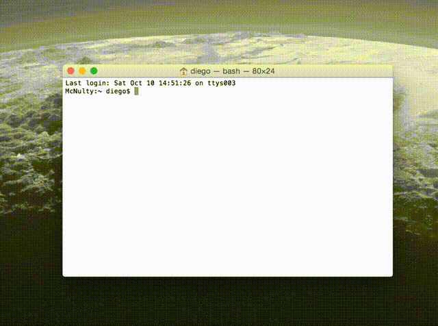

# Project Apollo Archive
Script written in python 2.7 to download the entire NASA's Project Apollo Archive hosted in flickr, with the original resolution. 

The script creates __number_of_threads__ asynchronous threads and each one downloads one picture. The pictures are stored in __destination_folder__. By default 4 threads are used, and the pictures are stored in the ~/Desktop/NASA_Apollo_Project/ folder, with ~ being expanded by the os module.

The file __photo_links__ contains url and name of the pictures. **Before initiates the download the script checks the destination folder for pictures and only get the remainig.**

Usage: 
```python
  python huston_we_want_pictures.py destination_folder number_of_threads
```
Nevertheless, it detects if you only change the number of threads or the destination folder, so it would run with or without any parameter.



It's a MASSIVE download (57 GB), by October 12th there are 13602 pictures. **So click, relax, and get ready to enjoy the views.** 
